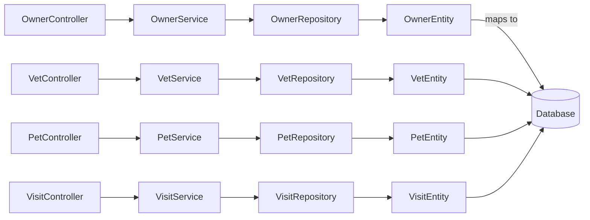

# Architecture

The PetClinic sample follows a classic **Layered MVC** pattern. The **presentation layer** consists of Spring MVC controllers that handle HTTP requests and render Thymeleaf views. Controllers delegate to the **service layer**, which encapsulates business rules such as scheduling visits, managing owners, and handling pets. The service layer talks to the **repository layer**, which uses Spring Data JPA to perform CRUD operations on JPA‑annotated **domain entities**. These entities are persisted in a relational database (H2 for development, MySQL/PostgreSQL for production).

All layers are loosely coupled through interfaces, making the system easy to test (unit and integration tests) and to replace implementations (e.g., swapping the database). The architecture also benefits from Spring Boot’s auto‑configuration, embedded servlet container, and dependency injection, providing a clean, maintainable code base that can be extended with additional features such as REST APIs or security modules.

## System Context

```mermaid
graph TB
  User[User] -->|Uses| WebApp[PetClinic Web Application]
  Vet[Veterinarian] -->|Uses| WebApp
  Owner[Pet Owner] -->|Uses| WebApp
  WebApp -->|Reads/Writes| DB[(Relational Database)]
  WebApp -->|Calls| External[External Services (e.g., Email, SMS)]
```
## Request Flow

```mermaid
flowchart LR
  Browser[Browser] -->|HTTP Request| API[Spring MVC Controller]
  API -->|calls| Service[Service Layer]
  Service -->|uses| Repo[Repository (Spring Data JPA)]
  Repo -->|executes| DB[(Database)]
  DB -->|returns data| Repo
  Repo -->|returns| Service
  Service -->|returns| API
  API -->|renders| View[Thymeleaf Template]
  View -->|HTML Response| Browser
```
## Dependencies


