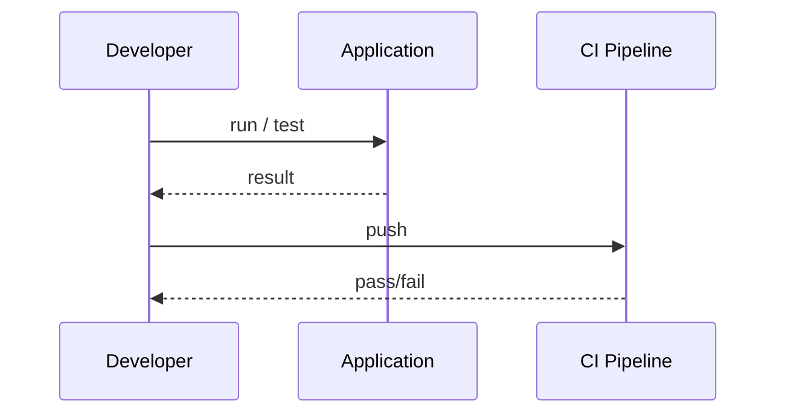

# Workflows

## Standard development workflow

- Install dependencies
- Run the application or tests
- Commit and push changes

### Sequence

```mermaid
sequenceDiagram
    participant Dev as Developer
    participant App as Application
    participant CI as CI Pipeline
    Dev->>App: run / test
    App-->>Dev: result
    Dev->>CI: push
    CI-->>Dev: pass/fail
```

